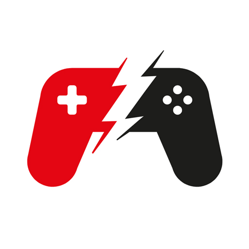
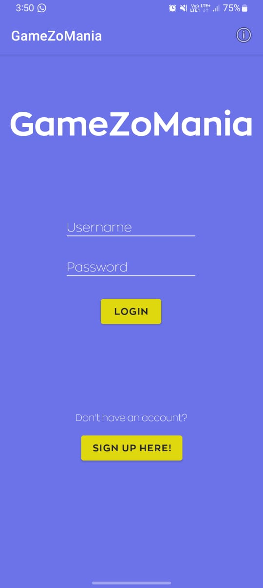
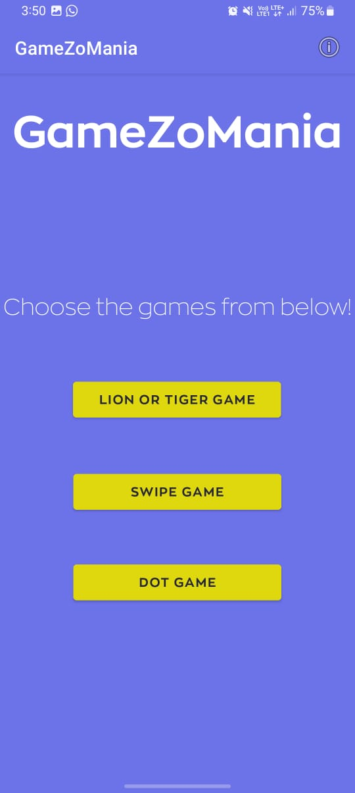
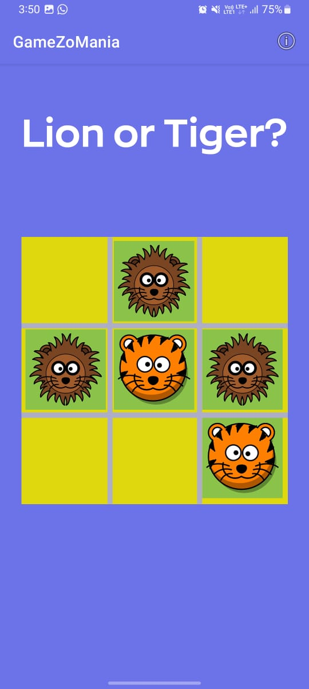
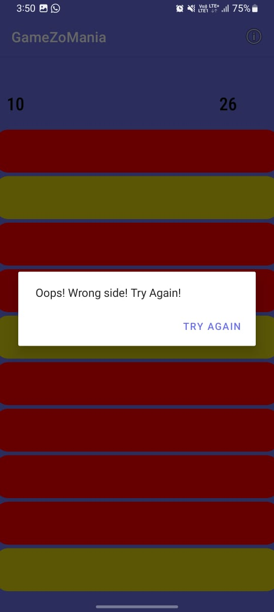
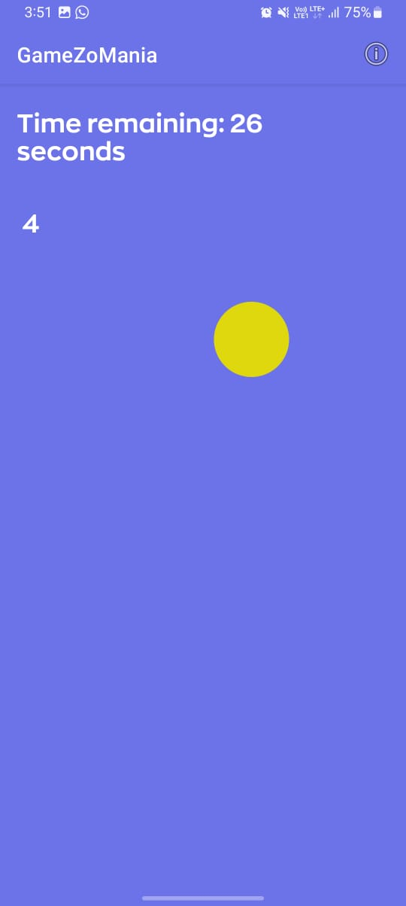

# GameZoMania

Welcome to GameZoMania! A mini-games app for Android, offering three engaging games: 'Tiger - Lion', 'Slide', and 'Dot Game'.

## Introduction

GameZoMania is designed to bring fun and excitement to Android users. With a clever mix of strategy, speed, and reflex challenges, this app is your go-to source for quick and enjoyable gaming experiences.

## Technical Specifications

- **Platform:** Android 9 (Native)
- **Programming Language:** Java (JDK-20)
- **Development Environment:** Android Studio 2022.2.1.20 
- **Database:** [Back4App](https://www.back4app.com/) (non-SQL)

## Game Features

1. **Tiger - Lion:** A clever take on classic tic-tac-toe where strategy and planning rule the day.

2. **Slide:** Get your adrenaline pumping with this high-speed challenge. Slide as many rectangles as you can within a given time.

3. **Dot Game:** Test your reflexes and speed. Can you touch as many dots as possible in the given time?

## Installation Guide

Download and install from the Google Play Store: [GameZoMania on Google Play](https://play.google.com/store/apps/details?id=com.rohan.parseemailverification)

## Screenshots

- **Login Screen:**

  

- **Choose Game Screen:**

  

- **Game 1 Screen:**

  

- **Game 2 Screen:**

  

- **Game 3 Screen:**

  

## User Guide

After installation, open the GameZoMania app, register or log in, choose your game, and let the fun begin!

## Privacy Policy

You can find the privacy policy [here](sites.google.com/view/gamezomania-privacy-policy/home)

## Credits

GameZoMania has been brought to life from IIIT Nagpur as a course project. Each game author is credited within the respective game section.

## Contributing

Got ideas to improve GameZoMania? Feel free to fork the project, make your changes, and submit pull requests.

## License

GameZoMania is an open-source software; see the [LICENSE](LICENSE) file for details.
